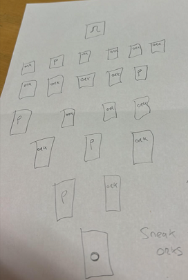
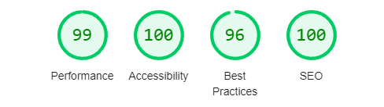

# **A Walk Through Mordor**

## **Site Overview**

A walk through Mordor is a game of chance, featuring four stages of face-down cards, with one being the correct choice, allowing you to move to the next stage. Each stage adds a card, making the chance of progressing harder. The design of the cards and the game is based on JRR Tolkens - The Lord Of The Rings. The idea is that the player starts by entering Mordor and as they progress through the stages they get closer to Mount Doom, where they will destroy the ring of power they carry. 
If they player selects a wrong card, they dont lose the game straight away. There is a pop up that apears, showing a randomly selected enemy and a required dice roll of a D20 dice. The player then rolls the dice and if they get a higher number than required, they get another chance to select the correct card and progress. If they roll under the required number, they lose. The game is won when the player finds the correct card on the final stage. 

## **Planning**

### **Target Audience**

* Users of all ages who enjoy simple RNG based games. 
* Users who like The Lord Of The Rings books and films
* Users that have limited time or attention and want a simple, fast game to play.

### **User Questioning**

* Users want a Rules section, with easy an to understand set of rules for the game.
* Users would like the game to be easy to navigate and understand.
* Users would like the theme to be obvious that it is based on The Lord Of The Rings series.

### **Websites Aim**

* Create an aesthetically pleasing game, that it simple and easy to navigate.
* To be enjoyable and fun to play.
* Create a theme based on The Lord Of The Rings films and books.
* Include reponsive feedback for user interactions with the cards and buttons.
* To have a random RNG element to the game.
* To be responsive to different screen sizes.

### **How Will This Be Achieved**

1. On page load, the user will be shown a Modal that has a brief description of the game, along with a start button and rules button. 
* On click of the start button, the modal will disappear and the game will load. 
* On click of the rules button, another modal will appear with a set of rules for the game and another start button for when the user is ready to begin the game. 

1. Have a hover function when the user moves the mouse over sections that they can click on.
 
1. Make it so when the user selects the correct card, it will turn green and when they select the wrong card, it will turn red.

1. When the user selects the wrong card, a modal will pop up, where the user will have to click a button to roll a D20 dice, to continue the game or start again.

1. An image of a randomly selected enemy will appear in the modal pop-up when the user selects the wrong card, with a unique required dice roll to continue the game.

1. The correct card position on each stage will be random on each load of the game. 

1. A win modal will appear when the user wins the game.

1. The images in the game will be based on the lord of the rings films.

1. Include the use of semantic elements, alternate text, and aria labels where appropriate.

## **Wireframes**

I started out this project with the idea of wanting to do something where RNG was involved and the results are different every time. 
I love the lord of the rings films, and they are also very popular and so i decided to base the game off of them.
I started drawing out the concept for the game, where there are four stages of RNG choice involved, with progressing difficulty.
I thought it would be a cool idea to have the user start at the entrance to mordor and the end result being mount doom, where they destroy the
ring of power.
I used the quote from the film where Boromir says 'one does not simply walk into Mordor' and made the title 'A walk through Mordor'.

On page load, I wanted a brief description of the game, and buttons to start the game or read the rules

Along the way, parts of the design changed. these include

* Having a modal pop-up when the user selects the wrong cards, appearing in the centre of the screen, rather than a small area in the right.
* The removal of the dice roll section, where i wanted a picture of a D20, showing the number of the roll when the user selects roll dice.
* Deciding not to go with the idea of choosing a class and having different skills that would affect the game results.
* Changing the intro paragraph 
* Adding a header and footer, with links to social media.

### **Color Scheme:**

I have kept the color scheme relevent to the dark theme of Mordor - this being black, dark gray and red.
This matches the theme of the game, being that you are in enemy teritory and by having a color scheme it keeps it aesthetically pleasing.

## **Features**
 
## ***Background*** 

I used an image of Mordor and Mount doom in the distance, to feel linked to the game - as if you are journeying across mordor to get to Mount doom and each stage completed progresses you towards that goal. 

To keep the image from being disrupted from the cards and other elements, i made the color of the cards slightly transparent.

##  ***Header Element***
The header element contains the following: -

### ***Title:***

  * I used the quote from the film where Boromir says 'one does not simply walk into Mordor' and made the title 'A walk through Mordor'.
  * I did not include an anchor tag here for this project since the app is only a single page of HTML.

  

  # **Main game page:**

  * The game page features four stages, including rows of 2,3,4 and 5 face down cards.
  * The rows are disabled until the user completes the stage they are on.
  * The cars turn green if the user selects the correct card and red if they select the wrong card. 

  

  # **Start modal pop-up**

* This includes a brief description of the game and story around what the user is doing in the game.
* It also has 2 buttons that the user can select, to either start the game, or read the rules.

# **Rules modal pop-up**

* Bullet points on have the game works
* Includes a button to start the game when the user is ready

# **Incorrect card selected modal pop-up**

* When the user selects a wrong card choice, it turns red and a modal will pop up showing -

* An image of a randomly selected enemy from a list of 5.
* A message describing that they have encountered an ememy and must roll a d20 dice to continue the game.
* The dice roll required to continue the game. 
* A button to roll the dice.

# **Dice roll modal pop-up**

* When the user clicks of the roll dice button, a modal will pop up showing - 

* The randomly rolled d20 rice result
* A message in green if they have rolled higher than the required dice roll
* A message in red if they have rolled lower than the required dice roll.
* An X in the corner of the modal to click which will close the modal -
the game will reload after the X is clicked when the user rolls under the required dice roll.

# **WIN modal pop-up**

* If the user selects the correct card on all stages they win the game and a modal will pop-up showing -

* An image of Sauron being destroyed 
* A message that they have won the game 
* An X in the corner of the modal to close the modal and reload the game.

# **Footer element**

* The footer had 2 clickable icons that will load a new page in a seperate browser. these being - 

* A link to an instagram and facebook page for the user to follow me.

## **Future-Enhancements**

The current state of the game is ready for release, but these are the future enhancements I would like to add.

This game was really fun to make and I was very passionate about it, but due to the project deadline, I have left some extra ideas out and will look to add them in the future. 
These include -

  * Game sounds 
  - Have noises for when the incorrect card choice is selected and an enemy pops up.
  - Have sound for the dice roll
  - Have sound for when you win the game 
  - Have Lord of the rings music playing during the game.

  * Dice roll animation - Show the dice rolling and landing on the result number.

  * Create different classes for the user to select on game load, such as elf, dwarf, man, which will effect dice roll requirment for different enemys.  

  ## **Testing Phase**

## **During Development Testing**

During the development process, I was manually testing in the following ways:-

1. Manually testing each element for appearance and responsiveness via a simulated live server in codeanywhere.
    
1. Published the page via GitHub pages and shared with friends and family and asked for feedback.

### ***Manual Testing:***
* During testing, I used three different browsers to ensure cross-compatibility. The desktop browsers used were -

  1. Chrome
  2. Firefox  
  4. Edge

* I used the dev tools to simulate different screen sizes/devices.

### ***Bugs and Fixes:***

1. Modal Display Problem

* Bug: Modals were not displaying or hiding properly when they should.
* Fix: Double-check the CSS and JavaScript functions responsible for showing/hiding modals to ensure they work correctly in all scenarios.
create functions to show and hide the modals and add them to javascript functions for when the modals should appear.

2. Card Clickability depending on row not working.

* Bug: Cards in later rows remain clickable when they should be disabled.
* Fix: Adjust the logic in enableNextStage function to properly enable/disable card interactions based on the current stage.
I changed the style.pointerEvents of the cards so that they are only clickable when on the correct stage.

3. Page Reloading when the user clicks on the X in the corner of the Modal, after passing the dice roll challenge.

* Bug: The page is not meant to reload if the user passes the dice roll stage and they click on the X to close the modal
* fix: create an onclick function for the span (X) that reloads the page when it is clicked. Put this inside the function for when the user loses the dice roll requirement.
Now by clicking on the span(X) when the user wins the dice roll, it closes the modal and does not reload the page.

4. Background image not loading on deployed website

* Bug: The background image was loading in code anywhere environment but not on the deployed website through GitHub.
* Fix: The image file path was missing a forward slash at the start, before assets.

5. Some content was not loading as intented by trying to manipulate elements using javascript.

* Bug: The text content I wanted to appear on the dice result modal was not loading during gameplay.
* Fix: I found that when I was pulling certain classes or IDs using JavaScript, I missed out on the starting document. part. 
- Before would be .getElementById("result-win").textContent
- After would be document.getElementById("result-win").textContent

## **Post Development Testing**
### **Validators**

#### ***HTML*** - [https://validator.w3.org/nu/]

Returned no errors when checking the HTML document.

#### ***CSS*** - [https://jigsaw.w3.org/css-validator/]

All pages tested, no issues found via URL or file upload.  
  

#### ***JSHint*** - [https://jshint.com/](https://jshint.com/)

Besides the occasional missing semicolon, the only thing shown by JsHint was the below  warning: -

 * Functions declared within loops referencing an outer scoped variable may lead to confusing semantics. (stage, currentStage, card, showFinishModal, selectableRows, enableNextStage, showModal)

 ### **Lighthouse Scores**
#### **Test conditions**

* I did all lighthouse tests in incognito mode to avoid interference from browser extensions. 
* I ran the tests for both mobile and desktop. 

#### ***Desktop Version:***

#### ***Mobile Version:***

### **Accessability**

In addition to the lighthouse accessibility score, I also used WAVE - Web accessibility evaluation tool to check my pages for accessibility, and the site returned no errors.

## **Deployment**
I deployed the page on GitHub pages via the following procedure: -

1. From the project's [repository](https://github.com/jordzen/A-Walk-Through-Mordor), go to the **Settings** tab.
1. From the left-hand menu, select the **Pages** tab.
1. Under the **Source** section, select the **Main** branch from the drop-down menu and click **Save**.
1. A message will be displayed to indicate a successful deployment to GitHub pages and provide the live link.

You  can find the live site via the following URL - [Live game](https://jordzen.github.io/A-Walk-Through-Mordor/)
***

### **Honorable mentions:** 

A massive thankyou to David Bowers (https://github.com/dnlbowers) who has helped me alot through my course and this project and had given me motivation when struggling.

## **Credits**

* All fonts imported from - [Google Fonts](https://fonts.google.com/)
* Icons in the footer were taken from [Font Awesome](https://fontawesome.com)
* All content was writen by myself and the images are AI generated.
* The theme and game are based on J.R.R. Tolkien's The Lord Of The Rings. 
* https://validator.w3.org/ was used to validate HTML.
* https://jigsaw.w3.org/css-validator/validator was used to validate CSS.
* https://jshint.com/ was used to validate Javascript.
* https://ui.dev/amiresponsive was used for my responsive image in this file.